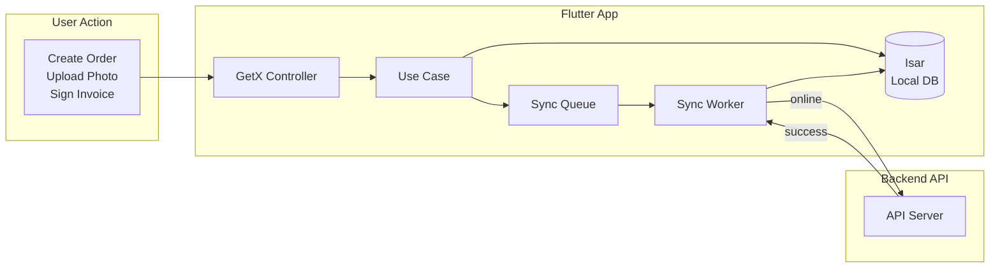
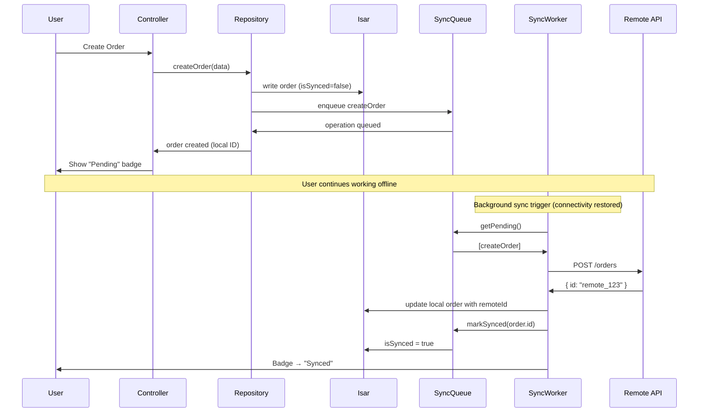
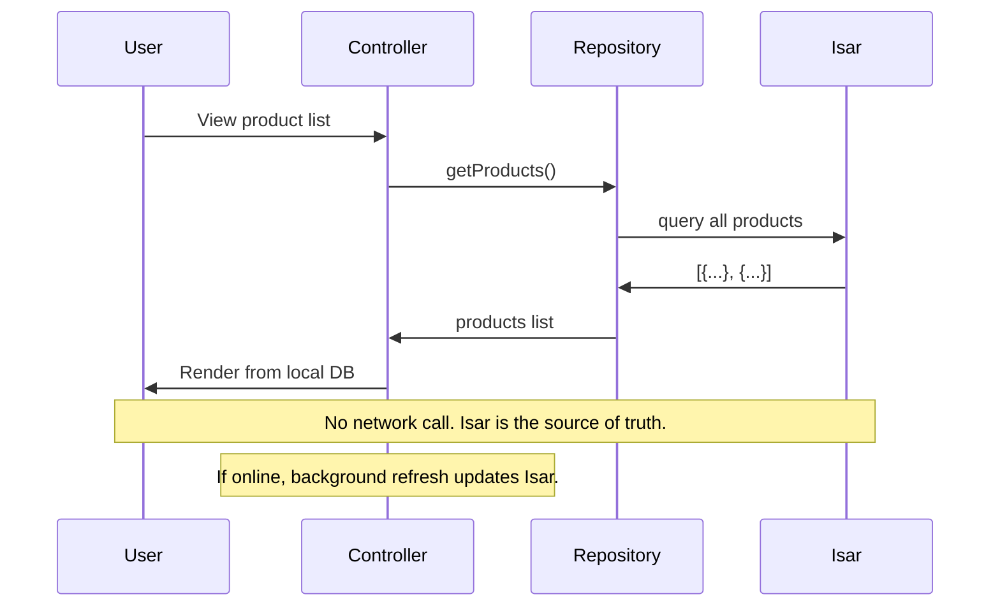

# Architecture Overview

## System Flow



## Write Flow (Offline)



## Read Flow (Offline)



## Conflict Resolution Flow

```mermaid
flowchart TD
    A[Device A modifies price offline] --> B{First to sync?}
    C[Device B modifies same price offline] --> B
    B -->|Device A| D[API accepts: price = Device A value]
    D --> E[Device B syncs: 409 Conflict]
    E --> F[UI shows "Conflict: price differs"]
    F --> G{User chooses}
    G -->|Keep theirs| H[Accept API value]
    G -->|Keep mine| I[Force push local value]
    H --> J[Resolved]
    I --> J
```

## Key Principles

1. **Local-first** — every write goes to Isar before anything else. The UI updates instantly regardless of network state.

2. **Queue-everything** — every write that needs to reach the server is recorded as a sync operation. No exceptions. Even if online, the write goes through the queue to ensure ordering.

3. **Ordered sync with dependency resolution** — operations are processed in order. If creating an order with photos, the order creation completes before photo uploads begin. The `parentOperationId` field enforces this.

4. **Exponential backoff** — failed operations retry at increasing intervals: 30s, 60s, 120s, 240s... capped at 30 minutes.

5. **Transparent status** — users see exactly what is synced (green), pending (yellow), or failed (red). The badge updates in real-time via GetX reactive state.

## Storage Architecture

```
┌──────────────────────────────────────────────────┐
│                   Isar Database                     │
│                                                     │
│  ┌──────────────┐  ┌──────────┐  ┌──────────────┐  │
│  │   Products    │  │  Orders   │  │   Invoices    │  │
│  │  ┌──────────┐ │  │ ┌──────┐ │  │ ┌──────────┐ │  │
│  │  │name      │ │  │ │items │ │  │ │signature  │ │  │
│  │  │price     │ │  │ │total │ │  │ │photos     │ │  │
│  │  │stock     │ │  │ │status│ │  │ │amount     │ │  │
│  │  │isSynced  │ │  │ │syncd │ │  │ │isSynced   │ │  │
│  │  └──────────┘ │  │ └──────┘ │  │ └──────────┘ │  │
│  └──────────────┘  └──────────┘  └──────────────┘  │
│                                                     │
│  ┌──────────────────────────────────────────────┐   │
│  │           SyncOperations Queue                 │   │
│  │  ┌─────────┬──────────┬────────┬──────────┐   │   │
│  │  │entityId │ operation│ payload│parentOpId│   │   │
│  │  │order_42 │ create   │ {...}  │ null     │   │   │
│  │  │order_42 │ upload   │ {...}  │ order_42 │   │   │
│  │  └─────────┴──────────┴────────┴──────────┘   │   │
│  └──────────────────────────────────────────────┘   │
└─────────────────────────────────────────────────────┘
```

## Schema Migrations

All schema changes are tracked via a version number stored in SharedPreferences. Each migration function handles one version transition:

| Version | Change |
|---------|--------|
| 0 | Initial schema |
| 1 | Add remoteId field to Order collection |
| 2 | Add soft delete support (isDeleted flag) |

## Tech Stack

| Component | Technology | Rationale |
|-----------|------------|-----------|
| Local Database | Isar 3.x | Fastest embedded DB for Flutter, reactive queries, ACID compliance |
| State Management | GetX | Controllers persist across navigation, built-in DI, minimal overhead |
| Background Sync | WorkManager | Android-native job scheduling, respects Doze mode |
| Network | Dio | Interceptors for retry logic, multipart upload support |
| Connectivity | connectivity_plus | Cross-platform network monitoring |
| Queue Persistence | Isar (same instance) | Operations stored as Isar collections, no separate queue system |
